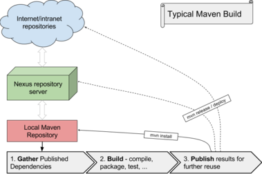
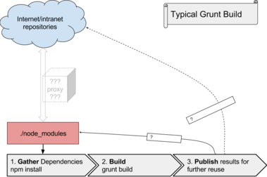

## Overview

NPMPACK maven plugin simplifies integration of UI build, performed by NodeJs/NPM based tools like Grunt, into Maven build.

It is designed to:

- connect the two worlds, Maven and NPM, without compromises and hard impact on workflow of any of them
- reduce or prevent NPM to download bits from whole internet during regular project build, to remove significant source of build instability
- store npm dependencies by Maven's mature repository and caching system

## The difference between Maven and Grunt build

The important piece here is the **Nexus** server (or in general, Maven Repository Manager).

It acts as the caching proxy, which isolates build of the project from temporary outages. Cached artifacts are typically available on your local network.

Another important point is that Maven's local repository is *outside* the project source tree, and is therefore not frequently cleaned. 

It introduces yet another level of caching, this time directly at the machine. 

With `grunt`, which uses `node` and `npm` for preparing dependencies, there is no such component.
Theoretically, a generic caching HTTP proxy can be involved to handle its role, and probably some already exists. TODO: explore this.

But here comes the other disadvantage of `node` approach: the local cache is (by default) in the `node_modules` directory, and is therefore subject to frequent cleanup.
This makes the build frequently exposed to interaction with network, typically internet, and therefore very sensitive to various kinds of outages. Simply, less stable. 

## The integrated build

The problematic part is that `npm` gathers dependencies in directory `node_modules` during every build.

To prevent this, the `npmpack-maven-plugin` takes complete care about this directory. That is:

* if it exists but is obsolete (because `package.json` has changed), deletes it
* if it does not exist, downloads (or locates in local repo) *maven artifact* which contains it
* if it cannot be downloaded, it normally fails the build *(regular build)*
* in *maintenance build*, it calls `npm install` and then packages the resulting `node_modules` as a maven artifact. Then the developer's should publish it into Nexus for sharing with the team.

We assume that npm dependencies (expressed in the `package.json` file) do not change very often.
Therefore, as noted above, we differentiate between two build types:

* **regular** build, which is the one that your CI system is configured to always perform, and developer uses most of the time. NPM is *not* allowed to access internet; everything must come through Maven repositories.
* **maintenance** build, during which developer prepares Maven artifacts wrapping the changed npm dependencies. NPM of course uses internet to gather the packages.

### Regular build
This is the everyday build, intended for use in Jenkins and most developer usecases.
To enforce it, add `-Dnpmpack.allowNpmInstall=false` to Maven commandline - but it is a default, unless your POMs define otherwise.

### Maintenance build
During this build, we allow NPM to install components, or different versions, from internet.
This gives the developer an opportunity to take care with any issues that NPM may have.
To use it, add `-Dnpmpack.allowNpmInstall` to your Maven Commandline.

In this case, the plugin does not fail when `package.json` is changed; instead, it invokes `npm install` and generates new package. The developer should upload this new package into a Nexus (or other Maven Repository Manager) so that CI and other developers can use it.

Note that the generated artifact comes together with generated pom file, to avoid any mistakes during upload.
